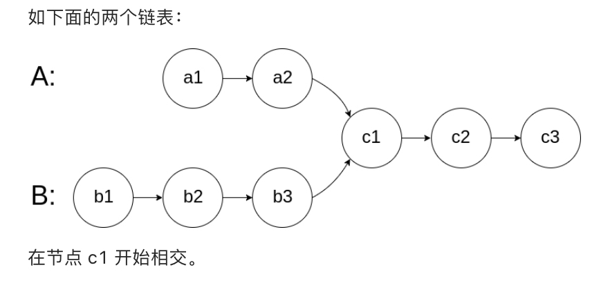

### JZ36两个链表的公共节点
>输入两个链表，找出它们的第一个公共结点。（注意因为传入数据是链表，所以错误测试数据的提示是用其他方式显示的，保证传入数据是正确的）


1. 看到题目想到的第一个想法是先各自遍历一次链表，计算长度，将比较长的链表多出来的部分去掉，然后逐个比较节点，第一个相同的就是公共链表
	- 时间复杂度是O(m+n)
2. 另一个想法是从链表的后面开始遍历，最后一个相等的数就是第一个公共节点
	- 要实现这个想法需要两个辅助栈分别入栈两个链表的数，然后逐个出栈
		- 时间复杂度O(m+n)
		- 空间复杂度O(m+n)
3. 看题解突然看到一个非常巧妙的想法：
	- 虽然链表A与链表B的长度不一定相等，但是链表A+B与链表B+A的长度一定相同，只要逐个比较A+B与B+A，第一个相同的节点就是公共节点
		- 时间复杂度O(m+n)

```
/*function ListNode(x){
    this.val = x;
    this.next = null;
}*/
function FindFirstCommonNode(pHead1, pHead2)
{
    // write code here
    if(!pHead1 || !pHead2)
        return null;
    
    let p1=pHead1,
        p2=pHead2;
    //因为题目保证传入数据是正确的，所以不需要考虑如果没有公共节点会造成死循环的部分
    while(p1!=p2){
        p1=p1?p1.next:pHead2;
        p2=p2?p2.next:pHead1;
    }
    return p1;
}
```
