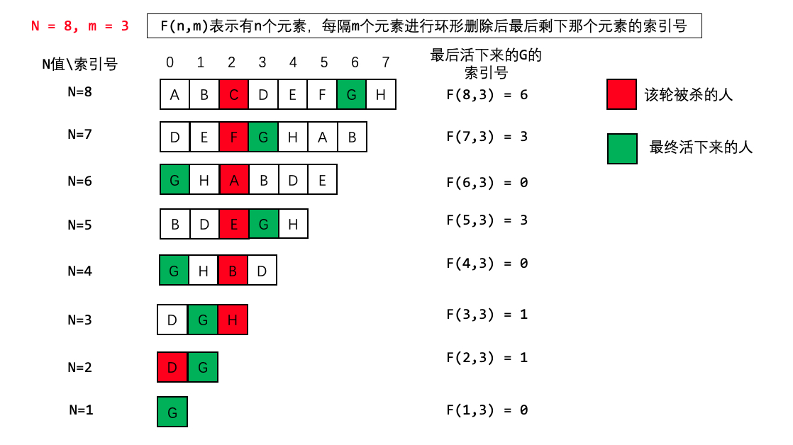
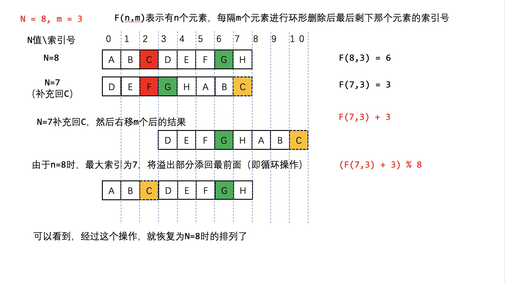

### JZ46圆圈中剩下的数字（约瑟夫环）
> 0,1,,n-1这n个数字排成一个圆圈，从数字0开始，每次从这个圆圈里删除第m个数字。求出这个圆圈里剩下的最后一个数字。
>例如，0、1、2、3、4这5个数字组成一个圆圈，从数字0开始每次删除第3个数字，则删除的前4个数字依次是2、0、4、1，因此最后剩下的数字是3。  
>示例 1：
>输入: n = 5, m = 3
>输出: 3  
>示例 2：
>输入: n = 10, m = 17
>输出: 2

#### 暴力模拟$O(n^2)$
- 自己生成一个Array来模拟弹出圆圈的过程

```
function LastRemaining_Solution(n, m)
{
    // write code here
    if(n<=0)
        return -1;
    
    let arr=[],		//模拟一个Array
        head=0;		//储存下次计数的开始节点
    
    //给定编号
    for(let i=0;i<n;i++)
        arr.push(i);
    
    while(arr.length>1){
        head=(head+m-1)%arr.length;
        arr.splice(head,1);
    }
    return arr[0];
}
```

#### 数学推导O(n)
- 参考：[LeetCode](https://leetcode-cn.com/problems/yuan-quan-zhong-zui-hou-sheng-xia-de-shu-zi-lcof/solution/huan-ge-jiao-du-ju-li-jie-jue-yue-se-fu-huan-by-as/)
- 思路：观察活着的那个人的位置变化，**最后剩下的人在最后的位置必定为0**

- 反推：N=7到N=8发生了什么？
	1. 将原本删除的C插入到队列末尾
	2. 将整个队列右移m位
	3. 将多出来的部分插入队列开头（循环右移的意思）  

- 结论：可以看出，N的状态是由N-1的状态+m位再进行循环右移得到的，也就是说：
$f(N,m)=\begin{cases} 0, &N=1 \\ \left[f(N-1,m)+m \right]\%N, &N>1\end{cases}$

##### 递归实现

```
function LastRemaining_Solution(n, m)
{
    // write code here
    if(n<1)
        return -1;
    return f(n,m);
}

function f(n,m){
    if(n==1)
        return 0;
    let x=f(n-1,m);
    return (x+m)%n;
}
```

##### 迭代实现

```
function LastRemaining_Solution(n, m)
{
    // write code here
    if(n<1)
        return -1;
    
    //最后一个小朋友一定是在第一位
    let pos=0;
    for(let i=2;i<=n;i++)
        pos=(pos+m)%i;
    
    return pos;
}
```