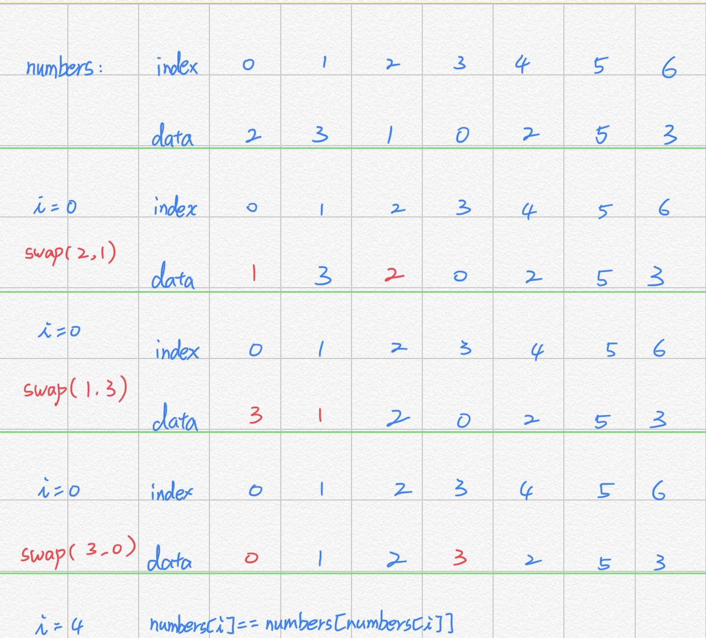

### JZ50数组中重复的数字
>在一个长度为n的数组里的所有数字都在0到n-1的范围内。 数组中某些数字是重复的，但不知道有几个数字是重复的。也不知道每个数字重复几次。请找出数组中任意一个重复的数字。 例如，如果输入长度为7的数组{2,3,1,0,2,5,3}，那么对应的输出是第一个重复的数字2。

#### 比较下标
- 思路：比较数组中一个数的indexOf()与lastIndexOf()如果两个数不同表示该数有重复

```
function duplicate(numbers, duplication)
{
    // write code here
    //这里要特别注意~找到任意重复的一个值并赋值到duplication[0]
    if(numbers.length<2){
        return false;
    }
    for(let i=0;i<numbers.length;i++){
       if(numbers.indexOf(numbers[i])!=numbers.lastIndexOf(numbers[i])){
           duplication[0]=numbers[i];
           return true;
       }
    }
    return false;
    //函数返回True/False
}
```

#### in-place算法
- 思路：题目线索有给出数组中的数字范围在0~n-1，所以只要将数字放到它相应的下标就好
- 算法：
	1. 使用一个指针i指向第一个数字
	2. 判断numbers[i]==i？如果等于，表示数字放在正确的位置，i++
	3. 如果不等于，则将numbers[i]与numbers[numbers[i]]交换
	4. 交换之后回到步骤2继续判断
	5. 在交换过程中如果遇到numbers[i]==numbers[numbers[i]]，表示遇到重复值，返回即可



```
function duplicate(numbers, duplication)
{
    // write code here
    //这里要特别注意~找到任意重复的一个值并赋值到duplication[0]
    if(numbers.length<2)
        return false;
    
    let i=0;
    while(i<numbers.length){
        if(numbers[i]==i)
            i++;
        else if(numbers[i]==numbers[numbers[i]]){
            duplication[0]=numbers[i];
            return true;
        }else{
        	//交换
            let temp=numbers[i];
            numbers[i]=numbers[temp];
            numbers[temp]=temp;
        }
    }
    return false;
    //函数返回True/False
}
```
