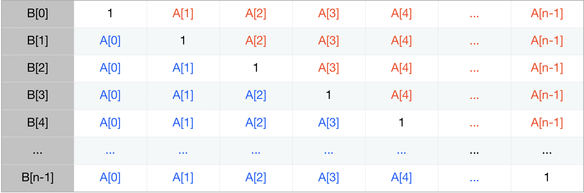

### JZ51构造乘积数组
> 给定一个数组A[0,1,...,n-1],请构建一个数组B[0,1,...,n-1],其中B中的元素B[i]=A[0]*A[1]*...*A[i-1]*A[i+1]*...*A[n-1]。不能使用除法。（注意：规定B[0] = A[1] * A[2] * ... * A[n-1]，B[n-1] = A[0] * A[1] * ... * A[n-2];）

#### 暴力计算$O(n^2)$
- 思路：直接使用双循环暴力乘

```
function multiply(array)
{
    // write code here
    if(array.length==0)
        return [];
    
    let result=[];    //存放结果
    let i=0;            //指向result的每一项
    while(i<array.length){
        result[i]=1;
        for(let j=0;j<array.length;j++){
            if(i===j)
                continue;
            else{
                result[i]*=array[j];
            }
        }
        i++;
    }
    return result;   
}
```

#### 拆分相乘O(n)
- 思路：将B拆分为左右两边，分别对两边进行计算

- 算法：
	1. 先创建一个与array长度一样的数组并初始化为1
	2. 计算左边蓝色部分：`B[i]=B[i-1]*A[i-1]`
	3. 计算右边部分并将其与左边部分相乘
	4. 使用`right`是为了保存上一次循环相乘的结果，确保红色部分的末尾也有被乘进去

```
function multiply(array)
{
    // write code here
    if(array.length<=1)
        return [];
    //创建一个与array长度一样的数组并初始化为1
    let result=Array(array.length).fill(1);
    
    //计算左半边的区块
    for(let i=1;i<array.length;i++){
        result[i]=result[i-1]*array[i-1];
    }
    let right=1;    //存放右边区域的上次循环结果
    for(let j=array.length-2;j>=0;j--){
        right*=array[j+1];
        result[j]*=right;
    }
    return result;
}
```
