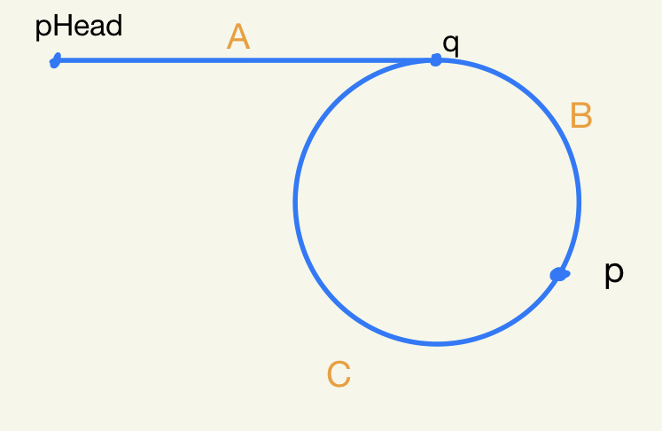

### JZ55链表中环的入口节点
> 给一个链表，若其中包含环，请找出该链表的环的入口结点，否则，输出null。

#### 快慢指针
- 思路：本解题思路具体可以分成三个部分
	1. 判断是否有循环：利用一对快慢指针，快指针走两步慢指针走一步，如果有环，快指针必定会与慢指针相遇
	2. 找出快慢指针相遇节点：如果有环，快慢指针必定相遇，假设相遇点为p，环的入口节点为q，pHead到q的距离为A，q到p的距离为B，p到q的距离为C，那么可以得出以下一幅图：

	3. 找出入口节点：由上图，我们可以得出一个公式`2(A+B)=A+nB+(n-1)C`,其中n代表B段路径快指针走了n次。以上公式化简得`A=(n-2)(B+C)+C`。这表示A的路径长跟走了n-2圈再走一段C是一样长的。如果我们分别用两个指针从pHead与p开始走，那么他们相遇的第一个节点就是环的入口节点
- 参考[牛客网](https://blog.nowcoder.net/n/deaa284f105e48f49f38b5d7cb809cd7?f=comment)

```
/*function ListNode(x){
    this.val = x;
    this.next = null;
}*/
function EntryNodeOfLoop(pHead)
{
    // write code here
    if(!pHead || !pHead.next)
        return null;
    
    let fast=pHead;
    let slow=pHead;
    //fast指针永远走在前面所以只要测试它就好
    while(fast!=null || fast.next!=null){
        fast=fast.next.next;
        slow=slow.next;
        //当他们相遇在p点时
        if(fast==slow){
            let head=pHead;
            //让两个指针分别从pHead跟p点开始走
            while(head!=slow){
                head=head.next;
                slow=slow.next;
            }
            //相遇的点就是入口节点
            return head;
        }
    }
    //如果没有环直接返回null
    return null;
}
```

